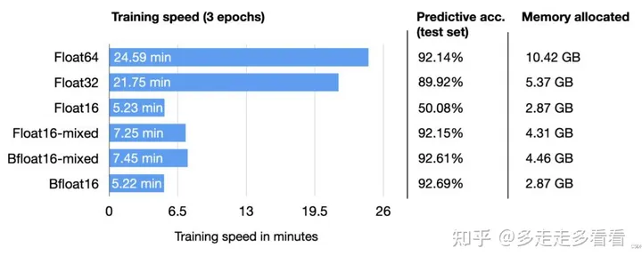
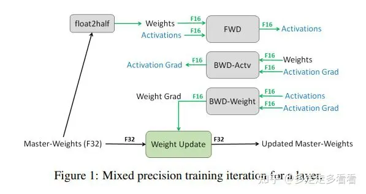

# 浮点数
## 背景
浮点数是计算机系统中用来表达实数的一种方式。这种表达方式利用科学计数法来表达实数，即用一个尾数( Mantissa，尾数有时也称为有效数字———Significand; 尾数实际上是有效数字的非正式说法) ，一个基数( Base) ，一个指数( Exponent) 以及一个表示正负的符号来表达实数． 比如 `123.45` 用十进制科学计数法可以表达为 $1.2345 \times 10^ 2$，其中 1.2345 为尾数，10 为基数，2 为指数． 浮点数利用指数达到了浮动小数点的效果，从而可以灵活地表达更大范围的实数。

## IEEE 754 标准
IEEE754 标准于 1985 年提出，是当前二进制浮点运算的格式标准． IEEE754 标准规定了两种基本浮点格式: 单精度和双精度。 IEEE754 标准要求浮点数必须是规范的。一个实数 $R$ 的二进制科学计数法可表示为 $R = (－1)^S \times 2^{E} \times M$，其中
* S 为实数的符号，`0` 正 `1` 负。 
* E 为二进制数的指数，
* M 表示尾数，规范的二进制数 $M=1.d_1,d_2, \cdots, d_{M}$ 基本浮点格式对应的类型为 Float 和Double。

浮点格式中最高位是符号位．中间是指数域，对应于二进制科学计数法中的指数部分，指数部分称为浮点数的阶码，采用移码方式存储。

## 浮点数的表示
单精度浮点数要指数值加上偏移量 127，双精度要指数值加上偏移量 1023。对于单精度浮点数，可以表达的指数真值的范围在 `－128` 到 `127` 之间。 指数真值 `－128` 以及 `－127` 保留用作特殊值的处理。 指数真值加上偏移量 127 之后，指数 E 的机器值为 1 到254，即采用移码后，指数的机器数全部用正数表示，便于比较浮点数的大小． 指数真值范围在 －126和 127 之间的浮点数称为规格化的浮点数。浮点格式的最后是尾数域，规范的二进制数的尾数小数点前面总是 1，所以在保存尾数的时候，可以省略小数点前面的 1。

fp32、fp16、bf16分别指单精度浮点数（float32）、Intel提出的半精度浮点数（float16)、nvidia提出的半精度浮点数（bfloat16）。名字当中的数字就对应了该种浮点数表示方法所占的bit数，那么fp16和bp16的存储空间天然就是fp32的一半。

以fp16为例，它占有16bit（2字节），其中5bit用来表示指数位（表示10的幂次），10bit用来表示小数位（也叫尾数位，表示浮点数的有效数字部分），还有一个符号位。5个指数位本来可以表示00000-11111，但是全0和全1有特殊含义，换算成10进制也就是1至30，减去偏置15、能表示的正负区间为-14至15，尾数位可以表示`1.0000000000` 至 `1.1111111111`（此时尾数位前的隐藏项为1），换算成10进制也就是[1, 2)。

上面提到的指数位全0和全1有什么特殊含义呢：

* 指数位全0表示非规格数，也就是+0、-0, 以及非常靠近0的数, 比如1E-38。
* 指数全1表示特殊数，有Inf和NaN两种情况。小数位全0表示无穷大inf，根据符号位不同可以分为+inf和-inf。小数位不全为0，表示NaN。
* 规格数和非规格数拼接起来才是一个完整的取值范围。
  
那么fp16所能表示的数的取值范围是多少？最大值 $1.1111111111 * 2^{11110}$ 换算成10进制也就是 $(1 + \frac{1023}{1024}) * 2^{15} = 65504$；而最小值 $-1.1111111111 * 2 ^{11110}$，换算成10进制也就是 $-(1 + \frac{1023}{1024})=-65504$；最小正值 $0.0000000001 * 2^{00000}$，此时指数位全0（也就是所谓的非规格数），注意此时指数位固定为 $1-偏置项=1-15=-14$，且尾数位前的隐藏项也不再是1而是0，所以换算成10进制也就是 
 $\frac{1}{1024} * 2 ^{-1024} = 2^{-24}=0.000000059604645$。所以fp16的动态范围为（5.96E−8~65504）。

用同样的办法，我们也能算出fp32的动态范围为(1.4E-45 ~ 3.40E38)。

而bf16呢？它相当于是将fp32的尾数位截断了，它跟fp16一样占16bit，跟fp32一样有8个指数位，那么说明它的尾数位只有7位，这样一来，我们就用损失精度的代价换来了几乎跟fp32一样大的取值范围，避免了fp16容易上、下溢的问题。它的最大值 
$1.1111111 * 2^{11111110}$ ,换算成10进制就是 $(1+\frac{127}{128}) * 2 ^{127}$，约为3.38E38；最小正值 $0.0000001 * 2^{00000000}$ ，换算成10进制也就是 $\frac{1}{128} * 2^{-126} = 2^{-133}$，约为9.2E−41，所以bf16的动态范围为(9.2E−41~3.38E38)。

## 二、混合精度
虽然理想情况下训练和推理都应该在fp32 中完成，但半精度占用内存更少、计算更快。

模型占用的内存更小，训练的时候可以用更大的batchsize。
模型训练时，通信量（特别是多卡，或者多机多卡）大幅减少，大幅减少等待时间，加快数据的流通。

而之所以要使用混合精度、而不是全部替换为半精度的原因是数据溢出和舍入误差。

### 2.1 数据溢出
对比它们的动态范围：

fp16（5.96E−8~ 65504）

fp32（1.4E-45 ~ 3.40E38)

bf16（9.2E−41~3.38E38)

显然，半精度跟单精度比，容易出现数据的上溢和下溢，其中在模型训练过程中，更有可能出现的是小梯度导致的下溢。

### 2.2 舍入误差
这三种精度它们的“间隔单位”也是不一样的，我们计算的最小正值就是它们的间隔单位，而间隔单位的大小决定了一个小值是否会被舍弃。比如说fp32和bf16虽然有大致一样的取值范围，但是它们的精度（间隔单位）是不一样的，当一个fp32的值+1.4E-45时，这个小值会被看到，原值会发生变动，但如果是一个bf16的值+1.4E-45，由于bf16的间隔单位为9.2E−41，这个小值就会被舍弃，原值不发生变动，这也就导致了舍入误差。

## 三、混合精度的使用
上面提到的两个问题，其实都是在模型训练过程中由于梯度更新导致的，所以如果是推理的话，直接降低精度即可。而训练的话，就需要混合精度了。

混合精度就是通过一些设计，使得我们可以享受半精度的优点，又可以一定程度规避数据溢出和舍入误差。

### 3.1 权重的高精度备份

这种方法主要是用于解决舍入误差的问题。我们使用 fp32 权重作为精确的 “主权重 (master weight)”进行备份，而其他所有值（weights，activations， gradients）均使用 fp16 进行计算以提高训练速度，最后在梯度更新阶段再使用半精度的梯度更新单精度的主权重，这样当很小的梯度*学习率后要跟权重（fp32的）做运算时，就不会被舍弃了。

由于 fp16 混合精度大大减少了内存需求, 并可以实现更快的速度, 因此只有在在此训练模式下表现不佳时, 才考虑不使用混合精度训练。 通常, 当模型未在 fp16 混合精度中进行预训练时, 会出现这种情况。 这样的模型可能会溢出, 导致loss为NaN。 如果是这种情况, 使用完整的 fp32 模式。

看到这里，可能有人提出这种 fp32 拷贝weight的方式，那岂不是使得内存占用反而更高了呢？是的， fp32 额外拷贝一份 weight 的确新增加了训练时候存储的占用。 但是实际上，在训练过程中，内存中占据大部分的基本都是 activations 的值。特别是在batchsize 很大的情况下， activations 更是特别占据空间。 保存 activiations 主要是为了在 back-propogation 的时候进行计算。因此，只要 activation 的值基本都是使用 fp16 来进行存储的话，则最终模型与 fp32 相比起来， 内存占用也基本能够减半。
### 3.2 Loss scale

上面这张图展示了在真实训练场景下梯度值的分布，可见大部分的值都很小，以fp16为例，它的指数范围是[-14, 15]，图中大部分梯度都小于这个范围、从而被归为0了。Loss scale要做的就是通过让梯度乘一个scale从而使得这个分布右移、占据更多fp16可表示的范围。

### 3.3 算数精度

神经网络的训练中主要涉及三种运算：向量点乘，reduction（减少一个tensor中的元素数量，往往对一个Tensor内的元素做归约操作，往往出现在batch-norm层），pointwise的运算。

向量点乘中的加法使用fp32来做，但以半精度的方式存储；reduction也要用fp32来做，但以半精度方式存储；

Whereas previous GPUs supported only FP16 multiplyadd operation, NVIDIA Volta GPUs introduce Tensor Cores that multiply FP16 input matrices and accumulate products into either FP16 or FP32 outputs (NVIDIA, 2017).
pointwise的运算（比如element-wise matrix products），收到memory-bandwidth限制，而且它们是以单精度还是半精度运算，都不影响计算速度，所以单、半精度均可。

## 四、量化的应用
根据第二部分中混合精度的使用方法，我们可以得知输入向量走过模型计算图时，所有权重矩阵都会依次执行反量化和重量化操作，所以，使用权重量化时，推理时间通常不会减少，反而会增加。

如何进行量化？使用huggingface时，是非常简单的，比如：

model = AutoModelForCausalLM.from_pretrained("...", torch_dtype=torch.bfloat16, device_map="auto", pad_token_id=0)
如果半精度无法满足你的需求，也可以进行8bit或4bit量化：

model = AutoModelForCausalLM.from_pretrained("...r", load_in_8bit=True, pad_token_id=0)
model = AutoModelForCausalLM.from_pretrained("...r", load_in_4bit=True, pad_token_id=0)

## 参考
1. https://zhuanlan.zhihu.com/p/657886517
2. https://deeprec.readthedocs.io/zh/latest/BFloat16.html
3. https://zhuanlan.zhihu.com/p/667163603
4. https://blog.csdn.net/Phoenix_ZengHao/article/details/118760774
5. 杜叔强,施武祖.浮点数用法分析[J].兰州工业高等专科学校学报, 2012.DOI:CNKI:SUN:LZGD.0.2012-03-013.
6. https://www.cnblogs.com/cbscan/articles/2032127.html
7. https://zhuanlan.zhihu.com/p/343033661
8. https://www.johndcook.com/blog/2018/11/15/bfloat16/
